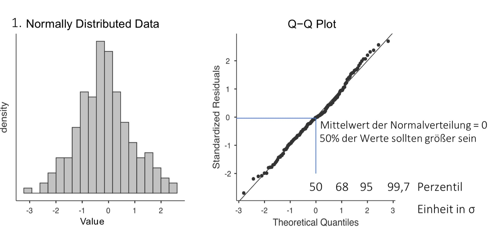
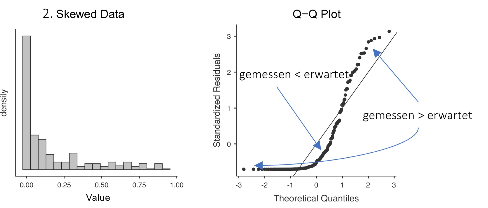
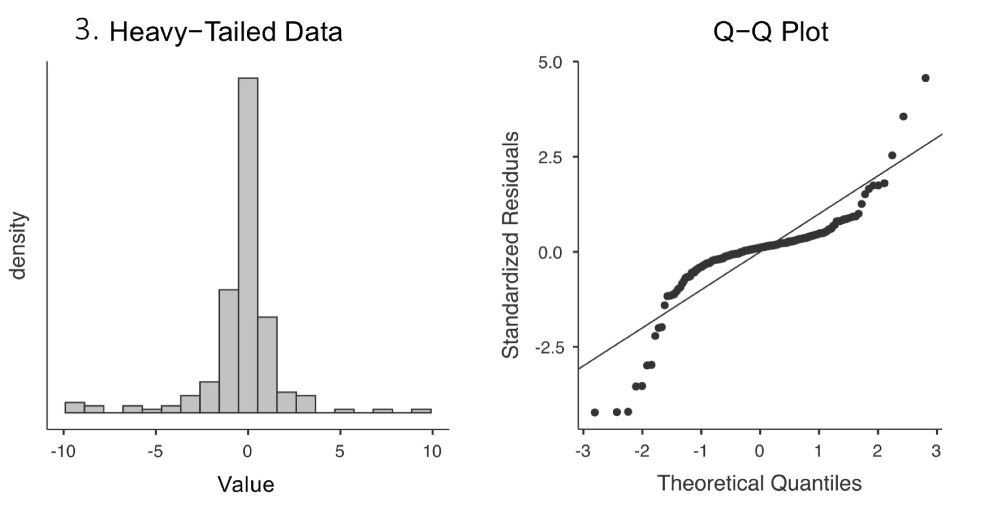

In vielen statistischen Verfahren ist die Annahme der **Normalverteilung** zentral, um gültige Signifikanztests (z. B. t- oder F-Tests) durchzuführen.
Dabei hängt es vom Verfahren ab, **welche Variable normalverteilt sein muss**:

* Beim **t-Test** (einfach, abhängig, unabhängig) wird die Normalverteilung der **Merkmalsverteilung** in der Population bzw. der **Gruppen** oder **Differenzwerte** angenommen.
* Bei der **linearen Regression** (einfach & multipel) müssen die **Residuen** des Modells normalverteilt sein – **nicht** die AV oder Prädiktoren.
* Bei **ANOVA**-Verfahren gilt dasselbe wie beim t-Test: Die **AV** sollte in jeder Gruppe normalverteilt sein.

Die Tests und Visualisierungen (Q-Q-Plot, Histogramm, Shapiro-Wilk etc.) bleiben gleich – nur der **Bezugspunkt** unterscheidet sich je nach Test.

---

### <u>Varianten:</u>

1. Grafische Analyse: Q-Q Plot
   
   * Vergleicht empirische Daten mit einer Theoretischen Verteilung
   * Normalverteilt:
     * Punkte liegen auf einer Linie
     * Leichte Schwankungen meist trzdm zu erkennen
       
   * Schiefe Verteilung:
     * Viele Werte sind kleiner/größer als erwartet			
   * Leptokurtisch
     * Starke Kniche an beiden Enden
     * Datenverteilung sehr gehäuft in der Mitte
       
1. Für n\<50: Shapiro-Wilk-Test
   
   * Hypothesentest:
     * **H₀**: Empirische Verteilung entspricht der theoretischen Verteilung (Normalverteilung)
     * **H₁**: Es gibt einen Unterschied
   * Entscheidung:
     * Wemp \< Wkrit oder p \< $\alpha$
       * Signifikant und Nullhypothese wird abgelehnt
     * <u>ACHTUNG:</u> hier wollen wir nicht signifikant werden da die Nullhypothese beibehalten wird sodass die Normalverteilung angenommen werden kann
   * Prüfgrößen Wkrit:
     * Wkrit liegt tabelliert vor
     * W= $\frac{\text{Varianz der erwarteten Quantile}}{\text{Varianz der Stichprobe}}$
     * Wertebereich: 0-1
       * =1 wenn Varianz der Stichprobe der Varianz der Normalverteilung entspricht
1. Für n>50: Kolmogorov-Smirnov-Test
   
   * "KSx2-anpassungstest"
   * Geringere Teststärke als SW-Test
   * Nicht Robust wenn Populationsmittelwert $\mu$ und Standartabweichung $\text{SD}$ nicht bekannt sind
   * behält H0 länger bei
   * Testet ob x-Werte der empirischen Verteilung $\phi$(x) , x-Werten einer theoretischen Normalverteilung $\phi$0(x) entsprechen
   * Hypothesen:
     * **H₀**: $\phi$(x) = $\phi$0(x)  (NVT)
     * H1: $\phi$(x) $\neq$ $\phi$0(x)  (keine NVT)
   * Entscheidung:
     * Dmax > Dkrit oder p \< $\alpha$
       * Signifikant und Nullhypothese wird abgelehnt
     * <u>ACHTUNG:</u> hier wollen wir nicht signifikant werden da die Nullhypothese beibehalten wird sodass die Normalverteilung angenommen werden kann
       * Und D wert soll kleiner sein als kritischer Wert
   * Prüfgröße Dmax:
     * x-Wert bei dem die Differenz zwischen empirischen und theoretischer Verteilung maximal ist

### <u>Navigation:</u>

* Voraussetzungspfad:
  
  * [Voraussetzungen](/normalverteilung-und-av-pruefen)
* T-Test:
  
  * [T-Tests](/t-tests)
  * [Einstichproben t-Test](/einstichproben-t-test)
  * [t-Test für Unabhängige Stichproben](/t-test-fuer-unabhaengige-stichproben)
  * [t-Test Für Abhängige Stichproben](/t-test-fuer-abhaengige-stichproben)
  * [Welsh-Test](/welsh-test)
* Lineare Regression:
  
  * [Lineare Regression](/lineare-regression)
  * [Einfache-lineare Regression](/einfache-lineare-regression)
  * [Multiple Lineare Regression](/Multiple-lineare-regression)
* ANOVA
  
  * [ANOVA](/anova)
  * [Einfaktorielle ANOVA](/einfaktorielle-anova)
  * [Mehrfaktorielle ANOVA](/mehrfaktorielle-anova)
